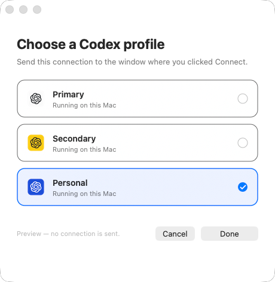
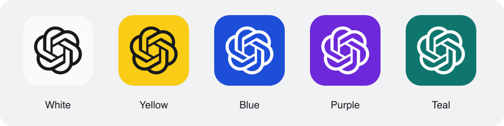

# multi-codex-app

Independent Codex desktop profiles, named launchers, and a connection chooser.



**Methodology credit: [Edi Hasaj](https://edihasaj.com)** and his guide, **[How to Run Two Codex Accounts on macOS with Separate Profiles](https://edihasaj.com/posts/two-codex-accounts-two-dock-icons-macos)**. This project builds on his `CODEX_HOME` plus Electron user-data-directory approach with a permanent installer, more profiles, and OAuth routing. It is an independent community project; no OpenAI or Edi endorsement is implied. Edi's installer code is not redistributed.

## Install

Install the official desktop app first. On **macOS or Linux**:

```sh
curl -fsSL https://raw.githubusercontent.com/am-will/multi-codex-app/main/install.sh | sh
```

The setup wizard asks how many profiles you want **in total**, including Primary, then lets you name every profile, choose each icon color, and review the result before installing a permanent CLI and helper. Released macOS binaries need no Node, Go, Swift, or Xcode.

Unattended installation:

```sh
curl -fsSL https://raw.githubusercontent.com/am-will/multi-codex-app/main/install.sh | sh -s -- --count 3
```

Supply `--app /absolute/path/to/ChatGPT.app` if detection fails. Linux needs a compatible installed desktop executable, `xdg-mime`, Python 3, and Tk (`python3-tk` on Debian/Ubuntu). This tool does not download or patch a Linux desktop distribution.

If `~/.local/bin` is missing from your PATH, add this to your shell configuration:

```sh
export PATH="$HOME/.local/bin:$PATH"
```

**Windows (experimental)** — download and inspect, then run in PowerShell:

```powershell
Invoke-WebRequest https://raw.githubusercontent.com/am-will/multi-codex-app/main/install.ps1 -OutFile install-multi-codex.ps1
.\install-multi-codex.ps1 -Count 3 -App 'C:\path\to\ChatGPT.exe'
```

Use the desktop executable, not the Codex CLI. Store-managed installs may need an explicit executable path and Default Apps selection. Open a new terminal after installing for the CLI to appear on PATH.

Installers verify release SHA-256 checksums before running the binary. Checksums protect download integrity and are published alongside artifacts. Releases are not notarized or developer-certificate signed. Do not disable OS security protections to run this tool. Inspect [install.sh](install.sh), [install.ps1](install.ps1), or build the source yourself.

## Use

```sh
multi-codex-app wizard            # count, names, colors, Dock pins, review
multi-codex-app list
multi-codex-app launch 2
multi-codex-app rename 2 Work
multi-codex-app rename 3 "Codex (Personal)"
multi-codex-app icons             # white, yellow, blue, purple, teal
multi-codex-app icon 2 yellow     # one profile
multi-codex-app icon 3 blue
multi-codex-app add               # asks how many additional profiles
multi-codex-app add --count 2     # adds two profiles
multi-codex-app setup --count 6   # refreshes six total profiles
multi-codex-app update
multi-codex-app doctor
multi-codex-app uninstall
```

Running `multi-codex-app` without arguments, or `setup` without `--count`, opens the wizard. Run `wizard` again any time to change existing names/colors or add more profiles by choosing a larger total. `add` without `--count` guides you through the new profiles only; `add --count N` uses default names/colors for unattended additions. `setup --count N` and `update` retain existing choices without prompting.

Setup never removes profiles or replaces their authentication. Sign into each new profile separately. Names appear in the chooser, helper menu, and OS launcher. `rename 2 Work` creates **Codex Work**; a name beginning with Codex is used as written, so `rename 2 "Codex (My Company)"` creates **Codex (My Company)**. IDs, data directories, and sign-ins stay attached to the same profile. Duplicate launcher names and names containing filesystem-reserved characters are rejected.

On macOS the installer creates named apps directly in `~/Applications` and registers them with Launch Services for Spotlight and Raycast. Earlier numbered launchers are migrated, preserving existing Dock pin positions. Raycast can take a moment to refresh its application index; add `~/Applications` to its application search scope if needed. New launchers are pinned to the Dock by default. Use `--no-dock` to skip pins. Running Codex windows may still group under the official icon: separate launcher pins cannot change the signed app's running identity. Windows creates Start-menu shortcuts; Linux creates desktop entries. Pin those manually using your OS.

Five icon colors are available: **white, yellow, blue, purple, and teal**. The first five profiles default to those colors in order; later profiles repeat the palette. `icon ID COLOR` changes one profile, and the choice persists across rename/setup/update. The OpenAI mark uses dark lines on white/yellow and white lines on blue/purple/teal, with at least 4.5:1 contrast. macOS uses the same artwork for launcher pins, Spotlight/Raycast results, helper menu rows, and chooser cards; Windows shortcuts use ICO files and Linux desktop entries use PNGs. Icons for the running official app may still group under its original identity.



The macOS menu-bar helper lists all profiles and offers a chooser preview. Start **Connect** in the intended profile, authorize in your browser, select that same profile, and click **Continue**. Closed or ambiguous processes are disabled on macOS; no account is preselected. Browser account selection is independent—choose the correct provider/ChatGPT account before authorizing.

## Platform status

| Feature | macOS 13+ arm64/x64 | Windows arm64/x64 | Linux arm64/x64 |
| --- | --- | --- | --- |
| CLI and profile management | Locally tested | CI-tested | CI-tested |
| Desktop launch | Locally tested | Experimental; runtime unverified | Experimental; runtime unverified |
| Chooser and forwarding | Native AppKit; exact PID delivery tested | WPF; forwarding unverified | Tk; forwarding unverified |
| Launchers | Dock apps | Start-menu shortcuts | Desktop entries |
| Real provider OAuth completion | User authorization required | Unverified | Unverified |

Windows/Linux forwarding invokes the desktop app with the selected user-data directory and original deep link, relying on Electron's profile-specific instance handling. Compatibility depends on the desktop distribution. Passing builds do not prove callback behavior across package formats. macOS sends an Apple Event directly to the selected running process.

## Existing profiles and state

Primary adopts `~/.codex` and normal desktop state. On macOS, if both `~/.codex-work` and `~/Library/Application Support/Codex Second` exist, Secondary adopts them. Other profiles get new private directories. No credentials are copied between accounts.

The earlier local `Codex Callback Router` login agent is retired, with its app and disabled agent file retained. Edi's Account Switcher remains installed and its shortcuts continue to work. When replacing his Primary/Secondary launcher wrappers, their original apps are backed up under `retired-launchers/`; uninstall restores them if the original paths are vacant. Other apps are never overwritten merely because their names match.

State lives in:

- macOS: `~/Library/Application Support/Multi Codex/`.
- Linux: `${XDG_DATA_HOME:-~/.local/share}/multi-codex-app/`.
- Windows: `%LOCALAPPDATA%\MultiCodex\`.

Each has `config.json`, the permanent CLI under `bin/`, and additional profiles under `profiles/`. Custom setups can edit the manifest's paths while the relevant profile is closed. `MULTI_CODEX_ROOT` selects another tool root for development; don't use a temporary location for real installs, because launchers persist that location.

OAuth callbacks stay in memory; this helper does not log or save their URLs or codes. macOS forwards the original URL only to the selected PID. It never falls back to another account after failure. The original signed Codex app is not modified. This does not merge account limits, billing, chats, or browser sessions.

macOS rechecks the handler every ten seconds because Codex reclaims it at startup. Wait a few seconds after opening Codex before connecting. On Windows/Linux, re-run setup or select the helper in Default Apps if another application reclaims the handler.

`uninstall` restores the saved prior handler and removes helper integration and managed launchers/pins. It retains the CLI, manifest, and profile data so sign-ins and chats are not lost. `setup` reinstalls integration. Back up profile data before manually deleting the remaining directory.

## Build

Go 1.24+; standard library only. Source builds on macOS also need Apple's Swift tools:

```sh
sh scripts/build.sh
go test ./...
go vet ./...
```

The macOS build embeds a universal native helper. Releases compile six OS/architecture binaries. CI runs Go tests on all three OSes and checks Swift compilation plus PowerShell/Python syntax.

## License

MIT for this project's original code. Methodology credit belongs to Edi Hasaj. OpenAI, ChatGPT, and Codex trademarks belong to their owners. The OpenAI mark in profile icons belongs to OpenAI and is excluded from the MIT license; see [icon attribution](cmd/multi-codex-app/assets/icons/README.md).
