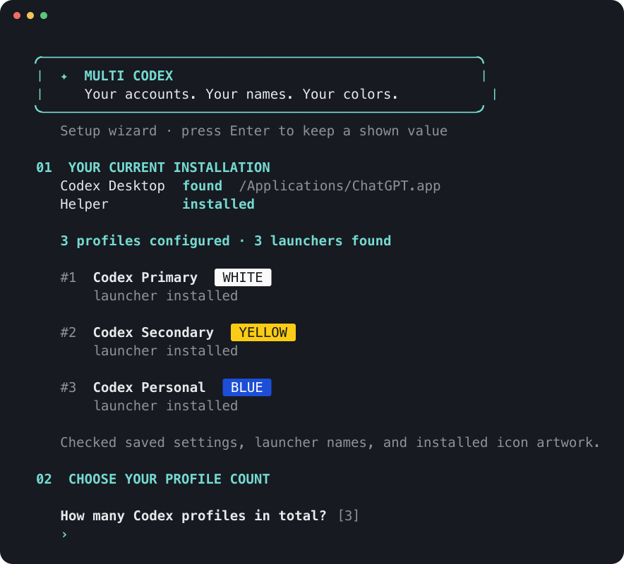

# Multi Codex App

**Run more than one Codex account at the same time.**

Multi Codex App gives each of your Codex accounts its own copy of the Codex desktop app, with its own name, Dock icon, sign-in, chats, and plugins. Your personal and work accounts can stay open side by side, so you never have to sign out to switch.

https://github.com/user-attachments/assets/de21fbea-44f5-4a70-a849-11caee7e6e9d

## What you get

- **A separate app for each account.** Launchers like "Codex Personal" and "Codex Work" each open their own Codex, signed in to their own account.
- **Names and colors you choose.** Five icon colors make each one easy to spot in the Dock, Spotlight, and Raycast.
- **Plugins per account.** Connect Gmail, GitHub, Figma, and more in one app without touching the others. You can connect the same plugin in several apps, each with its own login.
- **Everything runs at once.** Open as many as you need, side by side.
- **Shared chats and memories, if you want them.** Let some or all of your apps see the same chats and memories, and turn it off any time.
- **A one-line install.** A short setup wizard handles the rest.

<p align="center"></p>

## Install

**Before you start:** install the official Codex desktop app.

**On macOS or Linux,** paste this into Terminal:

```sh
curl -fsSL https://raw.githubusercontent.com/am-will/multi-codex-app/main/install.sh | sh
```

You don't need Node, Go, Swift, or Xcode. The installer opens a short setup wizard:

1. **It checks what you already have:** the Codex app, the helper, and any profiles or launchers from an earlier setup. It only looks; nothing changes until you confirm.
2. **You choose how many accounts you want in total,** including the one you use today.
3. **You name each one and pick its icon color** (type a color name or a number from 1 to 5).
4. **You review the plan, then it installs.**

<p align="center"></p>

When it's done, open each new app and sign in with the account you want it to use. Nothing is copied between accounts.

Run `multi-codex-app wizard` any time to come back. You can redo the full setup, edit one profile's name or color, add and remove a single profile, or [share chats and memories](#sharing-chats-and-memories).

<details>
<summary><b>Other ways to install</b> (skip the wizard, Windows, Linux)</summary>

<br>

**Skip the wizard** and create three profiles with default names and colors:

```sh
curl -fsSL https://raw.githubusercontent.com/am-will/multi-codex-app/main/install.sh | sh -s -- --count 3
```

If the installer can't find the Codex app, add `--app /absolute/path/to/ChatGPT.app`.

**"Command not found"?** Add `~/.local/bin` to your PATH, for example in `~/.zshrc`:

```sh
export PATH="$HOME/.local/bin:$PATH"
```

**Linux** needs a compatible desktop app already installed, plus `xdg-mime`, Python 3, and Tk (`python3-tk` on Debian and Ubuntu). This tool doesn't download or patch a Linux desktop app.

**Windows (experimental):** download the script, read it, then run it in PowerShell. Point `-App` at the desktop app, not the Codex CLI:

```powershell
Invoke-WebRequest https://raw.githubusercontent.com/am-will/multi-codex-app/main/install.ps1 -OutFile install-multi-codex.ps1
.\install-multi-codex.ps1 -Count 3 -App 'C:\path\to\ChatGPT.exe'
```

Store-managed installs may need the exact path to the app and a change in Default Apps. Open a new terminal afterwards so the CLI is on your PATH.

If a secondary profile shows **"Windows setup didn't finish"**, see [Windows sandbox troubleshooting](docs/windows-sandbox.md). Each profile has its own Codex configuration, so a sandbox setting that works in the original app may not apply to the new one.

**Is it safe to run?** The installers check each release's SHA-256 checksum before running it. Releases are not notarized or code-signed, so read [install.sh](install.sh) or [install.ps1](install.ps1) first, or build from source. Don't turn off your system's security settings to run it.

</details>

## Connecting plugins

When you connect a plugin such as Gmail, Codex sends you to your browser to approve it. The browser then hands the approval back to Codex. With several Codex apps open, Multi Codex needs to know which one should get it, so it asks:

<p align="center"></p>

1. In the Codex app you want, start connecting the plugin.
2. Approve it in your browser. Make sure you're signed in to the right account there first. The browser doesn't know which Codex app you started from.
3. When **Choose a Codex profile** appears, pick that same app and click **Continue**.

The plugin is added to that app only. To use the same plugin in another app, connect it there too, with whichever account you like. On macOS, apps that aren't running are greyed out, and nothing is selected for you.

> [!TIP]
> After opening Codex, wait a few seconds before connecting a plugin. Codex takes over the login link when it starts, and Multi Codex takes it back within about ten seconds.

On macOS, the menu-bar helper also lists all your profiles and can show a preview of the chooser.

## Sharing chats and memories

Each app starts with its own chats and memories. If you want an app to see the same chats and memories as another one, turn sharing on for it. You can turn it off again whenever you like.

The shared chats and memories live in one app, called the **owner**. That's profile 1, your original Codex, unless you pick another.

### Turn sharing on

1. **Quit the app** you want to change. On a Mac, press ⌘Q; closing the window isn't enough.
2. **Run `multi-codex-app wizard`** and choose **Share chats and memories between profiles**, then **Change one profile**. Pick the app and what it should share.
3. **Open the app again.** It now shows the shared chats and memories.

Or do it in one command, using the profile's number from `multi-codex-app list`:

```sh
multi-codex-app share 2 all
```

### Turn sharing off

1. **Quit the app.**
2. **Run `multi-codex-app share 2 off`**, or choose **Neither** in the wizard.
3. **Open the app again.** Its own chats and memories are back, exactly as they were.

Turning sharing off never deletes anything. Chats the app started while sharing stay with the shared chats, so the owner can still open them.

### What you can share

| Option | Command | What the app shows |
| --- | --- | --- |
| Chats and memories | `share 2 all` | The shared chats and the shared memories |
| Chats only | `share 2 chats` | The shared chats, with its own memories |
| Memories only | `share 2 memories` | Its own chats, with the shared memories |
| Neither | `share 2 off` | Its own chats and memories (the default) |

Run `multi-codex-app share` to see what each app shares.

### Good to know

- **Shared chats are live.** Every sharing app sees the same chats, including new ones from the others. Nothing is copied, so nothing gets out of sync and no extra disk space is used.
- **You can read every shared chat, but only continue your own.** Codex ties each chat to the account that started it. To pick up another account's chat, start a new chat and refer to it.
- **Memories grow in the owner.** Only the owner's app writes memories; the other apps read them. The more you use the owner, the more the shared memories grow, so make your most-used app the owner.
- **Work accounts.** When an app shares chats, the owner can learn memories from them, using the owner's account. If that's not OK for a work account, choose **Memories only** for it: it gets the shared memories without adding its chats.
- **Removing or uninstalling.** Turn sharing off first. Multi Codex reminds you if you forget.

<details>
<summary><b>More about sharing</b></summary>

<br>

- **Where your own chats wait.** While an app shares, its own chats and memories wait in a `.multi-codex-private` folder inside its Codex folder. Turning sharing off moves them back.
- **What's linked.** Sharing chats links the app's chat storage to the owner's: `sessions`, `archived_sessions`, the chat databases, attachments, generated images, and Codex's chat write locks. Codex already handles several apps using one copy, the same way the Codex CLI and desktop app share `~/.codex`. If two apps write to the same chat at once, the second is told the chat is busy. Sharing memories links the `memories` folders.
- **What stays separate.** Sign-ins, settings, and plugins always stay with each app. So does each app's memory database, so resetting memories in a sharing app can't clear the owner's.
- **Chats only.** An app that shares chats but keeps its own memories builds them from the shared chats. Those memories are kept for next time when it stops sharing.
- **Changing the owner.** `multi-codex-app share owner 3` works while nothing is shared. The new owner's own chats and memories become the shared ones.
- **After Codex updates,** run `multi-codex-app doctor`. If something needs repair, it tells you the command. Choosing an app's current option again, like `share 2 all`, always repairs it.
- **Platforms.** Sharing works on macOS and Linux. Windows isn't supported yet, because SQLite there doesn't follow links. Turning chat sharing off uses the `sqlite3` command, which macOS includes, or Python 3 on Linux.

</details>

## Everyday commands

| Command | What it does |
| --- | --- |
| `multi-codex-app wizard` | Open the setup wizard: full setup, edit one profile, add or remove one, or share chats and memories |
| `multi-codex-app list` | Show your profiles with their numbers, names, and colors |
| `multi-codex-app launch 2` | Open profile 2, or bring it to the front |
| `multi-codex-app rename 2 Work` | Rename profile 2 to "Codex Work" |
| `multi-codex-app icon 2 yellow` | Change profile 2's icon color |
| `multi-codex-app icons` | Show the five colors: white, yellow, blue, purple, teal |
| `multi-codex-app add` | Add more profiles (guided) |
| `multi-codex-app remove 4` | Remove profile 4's launcher but keep its data |
| `multi-codex-app restore 4` | Bring profile 4 back with its data |
| `multi-codex-app list --removed` | Show removed profiles you can restore |
| `multi-codex-app share` | Show which profiles share chats and memories |
| `multi-codex-app share 2 all` | Share chats and memories in profile 2 (or `chats`, `memories`, `off`) |
| `multi-codex-app share owner 3` | Make profile 3 hold the shared chats and memories |
| `multi-codex-app update` | Install the newest release and keep your profiles |
| `multi-codex-app doctor` | Check paths and login-link routing |
| `multi-codex-app uninstall` | Remove the integration but keep your data |

<details>
<summary><b>More about managing profiles</b></summary>

<br>

- **Names.** `rename 2 Work` creates **Codex Work**. A name that already starts with "Codex" is used as written, so `rename 3 "Codex (My Company)"` creates **Codex (My Company)**. Names show up in the chooser, the helper menu, and the app launcher. Duplicate names, and names with characters your file system doesn't allow, are rejected.
- **Numbers never change.** A profile keeps its number, data folder, and sign-in when you rename it or change its color. New profiles never reuse the number or data of a removed one.
- **Colors.** The first five profiles get white, yellow, blue, purple, and teal, in that order, and later ones repeat. Your choice sticks through renames, setup, and updates. The same artwork is used for launchers, Spotlight and Raycast results, the helper menu, and the chooser.
- **Adding.** `add` walks you through the new profiles. `add --count 2` adds two with default names and colors.
- **Full setup** never removes profiles or replaces sign-ins. `setup --count 6` makes sure you have six in total, and `update` keeps all your current choices.
- **Removing.** `remove ID` takes away that profile's launcher and Dock icon but keeps its sign-in, chats, settings, and data. It doesn't close a window that's already open. Removing your last profile also removes the helper. `restore ID` brings a profile back, as long as its name doesn't clash with another launcher. If the profile shares chats or memories, or is the owner of shared ones, turn sharing off first.
- **Plain text.** Set `NO_COLOR=1` or `TERM=dumb` to turn off the wizard's colors.

</details>

## Good to know

- **Dock grouping.** On macOS your colored launchers sit in the Dock, but running windows may still group under the original Codex icon. macOS groups windows by the signed app, and launchers can't change that.
- **Nothing is merged.** Each account keeps its own usage limits and billing, and its own chats unless you [share them](#sharing-chats-and-memories). Your web browser is shared, so pick the right account there when you approve a plugin.
- **Spotlight and Raycast.** Launchers are installed in `~/Applications`, so Spotlight and Raycast find them. Raycast can take a moment to notice new ones. If it doesn't, add `~/Applications` to its search scope.
- **Dock pins.** New launchers are pinned to the Dock unless you pass `--no-dock`. On Windows and Linux, pin the shortcuts yourself.
- **Your data stays put.** Removing a profile or uninstalling keeps your sign-ins and chats.
- **Login links stay private.** They're handled in memory and never logged or saved. On macOS each one goes only to the app you pick, and never falls back to another account.
- **Codex itself is untouched.** The official, signed Codex app is never modified.

## Platform support

| | macOS 13+ (Apple silicon and Intel) | Windows (arm64 and x64) | Linux (arm64 and x64) |
| --- | --- | --- | --- |
| Profiles and the CLI | Tested | Tested in CI | Tested in CI |
| Opening each app | Tested | Experimental, not yet verified | Experimental, not yet verified |
| Plugin chooser | Native app, tested | Experimental, not yet verified | Experimental, not yet verified |
| Launchers | Dock apps | Start menu shortcuts | Desktop entries |

On Windows and Linux, the chooser hands the login link to the desktop app for the profile you pick. That relies on how your copy of the desktop app handles multiple instances, so it can differ between package formats. If another app takes over the login link, run setup again or choose the helper in your Default Apps settings.

<details>
<summary><b>How it works</b></summary>

<br>

Each profile has its own Codex data folder (`CODEX_HOME`) and its own desktop app data folder. Each launcher opens the official Codex app with that profile's folders, so every instance keeps its own sign-in, chats, settings, and plugins.

When a plugin finishes signing in, your browser opens a Codex login link. Multi Codex registers itself to receive those links, asks which profile should get each one, and passes it on. On macOS it sends the link straight to the exact app you picked. It rechecks every ten seconds, because Codex claims the link again whenever it starts.

**If you already use Codex.** Your current account becomes profile 1 ("Primary") and keeps using `~/.codex` and its normal app data. On macOS, if you already have both `~/.codex-work` and `~/Library/Application Support/Codex Second` from a two-account setup, profile 2 ("Secondary") takes those over. Every other profile gets new private folders. Sign-ins are never copied between profiles.

**Coming from Edi's setup.** His Account Switcher stays installed and its shortcuts keep working. If his Primary and Secondary launchers are replaced, the originals are backed up under `retired-launchers/` and restored on uninstall if their old locations are free. Other apps are never overwritten just because their names match. The earlier local "Codex Callback Router" login agent is retired, and its app and disabled agent file are kept.

**Where your settings live:**

- macOS: `~/Library/Application Support/Multi Codex/`
- Linux: `${XDG_DATA_HOME:-~/.local/share}/multi-codex-app/`
- Windows: `%LOCALAPPDATA%\MultiCodex\`

Each holds `config.json`, the CLI in `bin/`, and the extra profiles in `profiles/`. You can change a profile's folders in `config.json` while that profile is closed. `MULTI_CODEX_ROOT` points the tool at a different folder for development. Don't use a temporary folder for a real install, because the launchers remember that location.

</details>

<details>
<summary><b>Uninstall</b></summary>

<br>

```sh
multi-codex-app uninstall
```

This restores the login-link handler you had before and removes the helper, the launchers, and their Dock pins. It keeps the CLI, `config.json`, and all profile data, so you don't lose sign-ins or chats. If any app still shares chats or memories, uninstall asks you to turn that off first, so each app has its own chats back. Run `multi-codex-app setup` to turn it back on. If you want to delete everything, back up your profile data before removing the folder by hand.

</details>

<details>
<summary><b>Build from source</b></summary>

<br>

You need Go 1.24 or newer (standard library only). On macOS you also need Apple's Swift tools.

```sh
sh scripts/build.sh
go test ./...
go vet ./...
```

The macOS build embeds a universal native helper. Each release includes binaries for six operating system and architecture combinations. CI runs the Go tests on all three operating systems and checks the Swift, PowerShell, and Python code.

</details>

## Credits

The idea comes from **[Edi Hasaj](https://edihasaj.com)** and his guide, **[How to Run Two Codex Accounts on macOS with Separate Profiles](https://edihasaj.com/posts/two-codex-accounts-two-dock-icons-macos)**. This project builds on his approach of a separate `CODEX_HOME` and app data folder per account, and adds a permanent installer, more profiles (up to 100), and plugin login routing.

This is an independent community project. No endorsement by OpenAI or Edi is implied, and Edi's installer code isn't included.

## License

MIT for this project's own code. OpenAI, ChatGPT, and Codex are trademarks of their owners. The OpenAI mark in the profile icons belongs to OpenAI and isn't covered by the MIT license. See the [icon notes](cmd/multi-codex-app/assets/icons/README.md).
